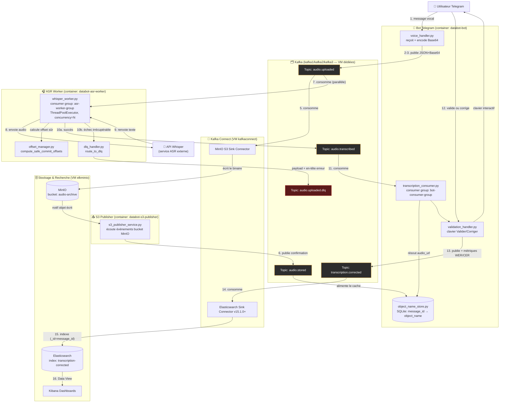

# 🎙️ DataBot — Pipeline événementiel de transcription vocale

> Bot Telegram → Kafka → ASR (Whisper) → MinIO → Elasticsearch/Kibana

[-231F20?logo=apachekafka)](#)
[](#)
[](#)
[](#)
[](#)

DataBot est un bot Telegram événementiel et **tolérant aux pannes** qui reçoit des messages vocaux, les fait transcrire par un service ASR (Whisper), permet à l'utilisateur de valider/corriger le texte, puis archive le résultat dans Elasticsearch pour recherche et visualisation dans Kibana.

Dernière consolidation : **3 août 2026** — tests de résilience, optimisation ASR, intégration Dead-Letter Queue (DLQ), containerisation des services applicatifs avec healthcheck.

---

## 📑 Sommaire

- [Architecture](#-architecture)
- [Flux détaillé (Mermaid)](#-flux-détaillé-mermaid)
- [Stack technique](#-stack-technique)
- [Infrastructure](#-infrastructure)
- [Structure du repo](#-structure-du-repo)
- [Installation](#-installation)
- [Configuration](#-configuration)
- [Utilisation](#-utilisation)
- [Résilience & DLQ](#-résilience--dlq)
- [Tests de charge](#-tests-de-charge)
- [Historique des incidents](#-historique-des-incidents)
- [Roadmap](#-roadmap)
- [Contribuer / Mettre à jour le repo](#-contribuer--mettre-à-jour-le-repo)

---

## 🏗 Architecture

```
[ Telegram User ]
       │ 1. Voice Msg
       ▼
 [ Bot Handler ] ── 2-3. Encode Base64 ──► [ Topic: audio.uploaded ]
                                                 │
              ┌──────────────────────────────────┴──────────────────────────────────┐
              ▼ (Étape 5)                                                           ▼ (Étape 6)
  [ Kafka Connect S3 Sink ]                                                [ ASR Whisper Worker ]
              │                                                                     │ 7-8. Whisper API
              ▼                                                                     ▼
     [ MinIO: audio-archive ]                                              [ Topic: audio.transcribed ]
              │                                                                     │
              ▼                                                                     ▼
  [ S3 Publisher Service ]                                                 [ Bot ASR Consumer ]
              │                                                                     │
              ▼                                                                     ▼
     [ Topic: audio.stored ]                                              [ User Valid/Correct ]
              │                                                                     │
              └─────────────────────────┬───────────────────────────────────────────┘
                                        ▼
                        [ Topic: transcription.corrected ]
                                        │
                                        ▼
                            [ Kafka Connect ES Sink ]
                                        │
                                        ▼
                              [ Elasticsearch / Kibana ]
```

### Table de référence des étapes

| # | Composant | Rôle | Action | Topic Kafka |
|---|-----------|------|--------|--------------|
| 1 | Utilisateur | Source | Envoie un message vocal au bot | — |
| 2 | Telegram Bot | Ingestion | Télécharge l'audio, encode en Base64, prépare le JSON (`message_id`) | — |
| 3 | Telegram Bot → Kafka | Producer | Publie l'événement audio | `audio.uploaded` |
| 4 | Kafka | Broker | Réplique le message (RF=3) | `audio.uploaded` |
| 5 | MinIO Sink Connector | Consumer | Écrit le binaire dans le bucket `audio-archive` | `audio.uploaded` |
| 6 | S3 Publisher Service | Producer | Publie la confirmation avec le chemin de l'objet | `audio.stored` |
| 7 | ASR Worker | Consumer | Consomme en parallèle (groupe dédié) | `audio.uploaded` |
| 8 | ASR Worker → API | Client HTTP | Envoie l'audio à l'API Whisper | — |
| 9 | API Whisper | Service ASR | Exécute l'inférence, renvoie le texte | — |
| 10 | ASR Worker → Kafka | Producer | Publie la transcription (ou route vers DLQ) | `audio.transcribed` / `audio.uploaded.dlq` |
| 11 | Telegram Bot | Consumer | Résout l'URL via `object_name_store`, envoie le clavier interactif | `audio.transcribed` |
| 12 | Utilisateur | Réviseur | Valide ou corrige la transcription | — |
| 13 | Telegram Bot → Kafka | Producer | Publie l'événement final + métriques WER/CER | `transcription.corrected` |
| 14 | ES Sink Connector | Consumer | Transmet à Elasticsearch | `transcription.corrected` |
| 15 | Elasticsearch | Base de données | Indexe (`message_id` = `_id`, idempotence) | — |
| 16 | Kibana | Visualisation | Data View, recherche, dashboards | — |

---

## 🧭 Flux détaillé (Mermaid)

Le diagramme ci-dessous détaille le flux exact de l'application : composants, topics Kafka, groupes de consumers, et chemins d'échec (DLQ).



**Légende rapide :**
- 🟠 Les topics Kafka standards sont en orange.
- 🔴 Le topic DLQ (`audio.uploaded.dlq`) est en rouge : c'est le chemin d'échec irrécupérable, jamais un cul-de-sac silencieux — il reste inspectable/rejouable (voir [Résilience & DLQ](#-résilience--dlq)).
- Les 3 containers applicatifs (`databot-bot`, `databot-asr-worker`, `databot-s3-publisher`) sont les seuls composants lancés en local via `docker compose` ; Kafka, Kafka Connect et la stack ELK/MinIO tournent sur des VM dédiées déjà provisionnées.

---

## 🧰 Stack technique

| Technologie | Rôle | Détails |
|---|---|---|
| Apache Kafka 3.x (KRaft) | Bus d'événements | Cluster 3 brokers, RF=3 |
| Kafka Connect (Distributed) | Intégration S3 & ES | `group.id=connect-cluster`, sur `kafkaconnect` + `kafka1` |
| MinIO | Stockage objet S3 | Bucket `audio-archive`, API :9000, Console :9001 |
| Elasticsearch 8.15.0 | Indexation & recherche | Mono-nœud, `xpack.security.enabled=false`, `number_of_replicas=0` |
| Kibana | Dashboards | Data View sur `transcription.corrected*` |
| Whisper API | Moteur ASR | `http://10.110.150.77/v1/audio/transcriptions` |
| Python 3.x | Bot & workers | `kafka-python`, `python-telegram-bot`, `requests`, `ThreadPoolExecutor` |
| SQLite | `object_name_store` | Table `message_objects` (`message_id` → `object_name`) |
| Docker / docker-compose | Containerisation des 3 services applicatifs | Healthcheck process + connectivité Kafka |
| stresstest.py | Tests de charge & qualité | Simulation d'injection, mock d'erreurs ASR, mesure de débit |

---

## 🖥 Infrastructure

| Hostname | IP | Rôle | Logiciels clés |
|---|---|---|---|
| `kafka1` | 10.110.188.121 | Broker Kafka 1 + Controller KRaft | Kafka, Connect (backup) |
| `kafka2` | 10.110.188.122 | Broker Kafka 2 + Controller KRaft | Kafka |
| `kafka3` | 10.110.188.123 | Broker Kafka 3 + Controller KRaft | Kafka |
| `kafkaconnect` | 10.110.188.124 | Nœud Kafka Connect principal | Connect Distributed (S3 & ES Sinks) |
| `elkminio` | 10.110.188.120 | Stockage & recherche | Docker (MinIO, Elasticsearch, Kibana) |
| `bot` | 10.110.188.125 | Application | Bot Telegram, ASR Worker, S3 Publisher (containers Docker) |

### Services & ports

| Service | URL | Identifiants |
|---|---|---|
| MinIO Console | http://10.110.188.120:9001 | admin / admin12345 |
| MinIO API | http://10.110.188.120:9000 | admin / admin12345 |
| Elasticsearch | http://10.110.188.120:9200 | Aucun |
| Kibana | http://10.110.188.120:5601 | Aucun |
| Kafka Connect REST API | http://10.110.188.124:8083 | Aucun |
| Whisper API | http://10.110.150.77/v1/audio/transcriptions | Aucun |
| Brokers Kafka | kafka1:9092, kafka2:9092, kafka3:9092 | Plaintext |

> ⚠️ **Sécurité** : les identifiants et endpoints ci-dessus sont pour un environnement de démo/dev. Avant toute mise en production, active TLS, l'authentification Kafka (SASL), la sécurité Elasticsearch, et déplace les secrets vers un gestionnaire de secrets (Vault, `.env` non commité, etc.).

---

## 📂 Structure du repo

Voici l'organisation recommandée pour un repo clean et professionnel :

```
databot/
├── README.md                     # Ce fichier
├── LICENSE
├── .gitignore
├── .env.example                  # Variables d'env sans valeurs sensibles
├── Dockerfile                    # Image partagée bot / asr-worker / s3-publisher
├── docker-compose.yml            # Lance les 3 services applicatifs (Kafka/ELK sont sur des VM dédiées)
├── healthcheck.sh                # Healthcheck générique (process + connectivité Kafka)
├── requirements.txt              # Requirements fusionnés pour l'image applicative
│
├── bot/                           # Application Telegram Bot
│   ├── main.py                    # Point d'entrée du bot
│   ├── handlers/
│   │   ├── voice_handler.py       # Étapes 1-3 : réception + encodage
│   │   └── validation_handler.py  # Étapes 11-13 : clavier interactif, correction
│   ├── consumers/
│   │   └── transcription_consumer.py  # Étape 11 : consumer audio.transcribed
│   ├── producers/
│   │   └── kafka_producer.py
│   ├── db/
│   │   └── object_name_store.py   # SQLite : message_id -> object_name
│   └── requirements.txt
│
├── asr-worker/                    # Worker de transcription Whisper
│   ├── whisper_worker.py          # Consumer + logique retry/DLQ (§4)
│   ├── offset_manager.py          # _compute_safe_commit_offsets (§4.1)
│   ├── dlq_handler.py              # Routage vers audio.uploaded.dlq (§4.2)
│   └── requirements.txt
│
├── s3-publisher/                  # Service de confirmation MinIO
│   ├── s3_publisher_service.py    # Étape 6 : publie audio.stored
│   └── requirements.txt
│
├── kafka/
│   ├── kraft/                     # Configs des 3 brokers KRaft
│   │   ├── kafka1.properties
│   │   ├── kafka2.properties
│   │   └── kafka3.properties
│   ├── connect/
│   │   ├── connect-distributed.properties
│   │   ├── minio-s3-sink.json     # Config connecteur S3 Sink
│   │   └── elasticsearch-sink.json # Config connecteur ES Sink (v15.1.0+)
│   └── topics/
│       └── create-topics.sh       # audio.uploaded, audio.transcribed,
│                                   # transcription.corrected, audio.uploaded.dlq
│
├── elk/
│   ├── elasticsearch/
│   │   └── elasticsearch.yml
│   └── kibana/
│       └── kibana.yml
│
├── stresstest/
│   └── stresstest.py               # mock-whisper / whisper-load / run
│
├── docs/
│   ├── architecture.md             # Schéma détaillé + table des étapes
│   ├── incidents.md                # Historique des incidents (§6)
│   └── runbook.md                  # Procédures d'exploitation / alerting DLQ
│
└── tests/
    ├── test_offset_manager.py
    ├── test_dlq_handler.py
    └── test_object_name_store.py
```

**Principes appliqués :**
- Un dossier par service/responsabilité (bot, worker ASR, publisher S3) → chaque composant est déployable/testable indépendamment.
- Les configs d'infra (Kafka, Connect, ELK) séparées du code applicatif.
- `docs/` pour tout ce qui est narratif (architecture, incidents, runbook) plutôt que de tout mettre dans le README.
- `tests/` en miroir de la structure du code.
- Aucun secret en dur : tout passe par `.env` (non commité) avec un `.env.example` documenté.

---

## ⚙️ Installation

```bash
git clone <url-du-repo> databot
cd databot
cp .env.example .env        # renseigner les IP/ports/credentials réels
```

> ℹ️ Kafka (kafka1/kafka2/kafka3), Kafka Connect et la stack ELK/MinIO tournent déjà sur des VM dédiées et provisionnées séparément (voir [Infrastructure](#-infrastructure)). Cette section couvre uniquement le démarrage des **3 services applicatifs** (bot, asr-worker, s3-publisher).

### 1. Vérifier que l'infrastructure externe est disponible

Avant de lancer l'application, confirme que ces briques répondent déjà :

```bash
# Kafka (depuis n'importe quel broker)
kafka-topics.sh --bootstrap-server kafka1:9092 --list

# MinIO
curl -f http://10.110.188.120:9000/minio/health/live

# Elasticsearch
curl -f http://10.110.188.120:9200/_cluster/health
```

Si les topics n'existent pas encore, les créer une seule fois :

```bash
bash kafka/topics/create-topics.sh
```

Et si les connecteurs Kafka Connect (S3 Sink / ES Sink) ne sont pas encore déployés :

```bash
curl -X POST -H "Content-Type: application/json" \
  --data @kafka/connect/minio-s3-sink.json \
  http://10.110.188.124:8083/connectors

curl -X POST -H "Content-Type: application/json" \
  --data @kafka/connect/elasticsearch-sink.json \
  http://10.110.188.124:8083/connectors
```

### 2. Lancer les 3 services applicatifs (bot, asr-worker, s3-publisher)

Une seule commande, depuis la racine du repo :

```bash
docker compose up -d --build
```

Ça construit une image unique (`Dockerfile`) et démarre 3 containers :

| Container | Commande exécutée | Rôle |
|---|---|---|
| `databot-bot` | `python3 -m bot.main` | Bot Telegram (réception, validation, correction) |
| `databot-asr-worker` | `python3 whisper_worker.py` | Transcription via Whisper + DLQ |
| `databot-s3-publisher` | `python3 s3_publisher_service.py` | Confirmation des écritures MinIO |

### 3. Vérifier que tout tourne (healthcheck inclus)

```bash
docker compose ps
```

La colonne `STATUS` doit passer à `healthy` pour les 3 containers après ~15-30s (délai de `start_period`). Chaque container est vérifié automatiquement toutes les 30s : process applicatif vivant + au moins un broker Kafka joignable (voir `healthcheck.sh`).

Pour suivre les logs en direct :

```bash
docker compose logs -f bot
docker compose logs -f asr-worker
docker compose logs -f s3-publisher
```

### 4. Arrêter / relancer l'application

```bash
docker compose down          # arrête et supprime les 3 containers
docker compose up -d --build # relance (rebuild si le code a changé)
docker compose restart asr-worker   # relance un seul service
```

### 5. Scaler l'ASR Worker (optionnel)

```bash
docker compose up -d --scale asr-worker=3
```

---

## 🔧 Configuration

Variables principales attendues dans `.env` :

```ini
TELEGRAM_BOT_TOKEN=
KAFKA_BOOTSTRAP_SERVERS=kafka1:9092,kafka2:9092,kafka3:9092
WHISPER_API_URL=http://10.110.150.77/v1/audio/transcriptions
MINIO_ENDPOINT=http://10.110.188.120:9000
MINIO_ACCESS_KEY=
MINIO_SECRET_KEY=
ELASTICSEARCH_URL=http://10.110.188.120:9200
ASR_WORKER_CONCURRENCY=5
ASR_WORKER_TIMEOUT_S=900
```

---

## ▶️ Utilisation

1. Envoyer un message vocal au bot Telegram.
2. Le bot renvoie la transcription avec un clavier interactif (✅ Valider / ✏️ Corriger).
3. Une fois validée/corrigée, la transcription (+ métriques WER/CER) est indexée dans Elasticsearch.
4. Consulter les dashboards dans Kibana (Data View `transcription.corrected*`).

---

## 🛡 Résilience & DLQ

### Commit d'offset manuel (`_compute_safe_commit_offsets`)

- `enable_auto_commit=False` : évite la perte de messages en cas d'échec/timeout Whisper.
- Traitement par lots (poll) en parallèle via `ThreadPoolExecutor`, concurrence pilotée par `ASR_WORKER_CONCURRENCY`.
- À la fin de chaque lot, calcul par partition de l'offset le plus élevé committable sans risque de saut de message.

### Dead-Letter Queue

- Les payloads invalides (Base64 corrompu, JSON malformé, clé manquante) ou les échecs ASR irrécupérables sont routés vers `audio.uploaded.dlq` avec l'en-tête d'erreur.
- Le message "poison" ne bloque plus la partition ; l'offset peut être committé en sécurité.

### Politique de gestion des pannes Whisper

| Type d'erreur | Stratégie |
|---|---|
| HTTP 5xx / 429 / erreurs réseau transitoires | Retry avec Exponential Backoff |
| Timeout HTTP sur pic de charge | Single Long Timeout (~900s), pas de retry immédiat pour éviter les doublons |

---

## 🧪 Tests de charge

```bash
# Simuler un serveur ASR défaillant (30% d'erreurs HTTP 500 / timeouts 65s)
python3 stresstest/stresstest.py mock-whisper --port 8080 --failure-rate 0.3

# Calibrer les limites de l'API Whisper (latence p50/p95/pmax)
python3 stresstest/stresstest.py whisper-load --concurrency 10 --duration 60

# Test end-to-end de charge sur le pipeline complet
python3 stresstest/stresstest.py run --count 500 --rate 20
```

**Formule de validation Zero Message Loss :**

```
Messages Envoyés = Messages Indexés (Elasticsearch) + Messages présents dans la DLQ
```

---

## 🧾 Historique des incidents

| Incident | Cause | Résolution |
|---|---|---|
| Saturation disque & crash Kafka Connect | Prolifération des logs sur `kafka1` | Troncature des logs, nettoyage `journalctl`, `connect-configs` avec `cleanup.policy=compact` |
| Workers Kafka Connect fantômes | Instance parasite sans plugins → HTTP 409 (rebalance conflict) | Synchronisation des plugins sur `kafka1`/`kafkaconnect` |
| Incompatibilité ES 8.15.0 vs connecteur v14 | `NullPointerException` en bulk indexation | Mise à jour vers ES Sink Connector v15.1.0+ |
| Cluster ES yellow | Nœud unique avec replicas > 0 | `number_of_replicas=0` |
| Divergence noms de topics | Incohérence de nommage | Alignement strict sur `audio.uploaded`, `audio.transcribed`, `transcription.corrected`, `audio.uploaded.dlq` |

Détails complets : [`docs/incidents.md`](docs/incidents.md)

---

## 🗺 Roadmap

- [ ] Alerte Kibana (ou consumer dédié) sur `audio.uploaded.dlq` pour rejouer automatiquement les messages après correction ASR.
- [ ] Politique de rétention des logs (3 jours max, `MaxBackupIndex=3`) dans `log4j.properties` sur tous les brokers.
- [ ] Exécuter `stresstest.py run` en pré-production avant chaque mise en prod.
- [ ] Activer la sécurité (TLS/SASL Kafka, x-pack Elasticsearch) avant tout déploiement exposé.
- [ ] Remplacer le healthcheck "process + connectivité Kafka" par un heartbeat applicatif (fraîcheur du dernier poll traité avec succès).

---

## 🔄 Contribuer / Mettre à jour le repo

### Workflow recommandé

```bash
# 1. Toujours partir d'une branche à jour
git checkout main
git pull origin main

# 2. Créer une branche dédiée par changement
git checkout -b fix/dlq-retry-policy

# 3. Faire les modifications, puis vérifier
git status
git diff

# 4. Committer avec un message clair (Conventional Commits recommandé)
git add asr-worker/whisper_worker.py
git commit -m "fix(asr-worker): corrige le calcul de l'offset sûr en cas de lot vide"

# 5. Pousser et ouvrir une Pull Request
git push origin fix/dlq-retry-policy
```

### Convention de commits

| Préfixe | Usage |
|---|---|
| `feat:` | Nouvelle fonctionnalité |
| `fix:` | Correction de bug |
| `docs:` | Documentation uniquement |
| `refactor:` | Changement de code sans impact fonctionnel |
| `test:` | Ajout/modification de tests |
| `chore:` | Maintenance (deps, CI, config) |

### Checklist avant de merger

- [ ] Le code respecte la structure du repo (bon dossier pour le bon composant).
- [ ] Aucun secret / credential en dur dans le code (tout passe par `.env`).
- [ ] `stresstest.py run` exécuté et formule Zero Loss vérifiée si le changement touche le pipeline.
- [ ] `README.md` / `docs/` mis à jour si l'architecture ou les topics changent.
- [ ] Tests unitaires ajoutés/mis à jour dans `tests/`.

### Bonnes pratiques pour garder un repo propre

- **`.gitignore`** : exclure `__pycache__/`, `.env`, `*.log`, `venv/`.
- **Un seul sujet par commit/PR** : facilite la revue et le rollback.
- **Documentation vivante** : toute évolution d'architecture (nouveau topic, nouveau connecteur) doit être répercutée dans `docs/architecture.md` et la table des étapes du README.
- **Tags de version** (`git tag v1.2.0`) à chaque mise en production stable, avec un `CHANGELOG.md` optionnel si le rythme de release s'accélère.
- **CI (optionnel mais recommandé)** : ajouter un workflow GitHub Actions qui lance `tests/` et un lint (`flake8`/`ruff`) à chaque PR.

---

## 📄 Licence

Ce projet est distribué sous licence MIT — voir [`LICENSE`](LICENSE).