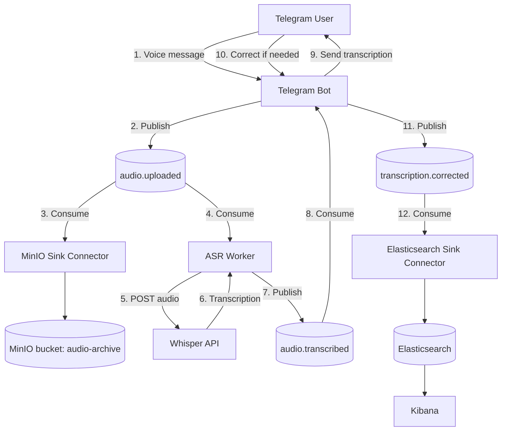
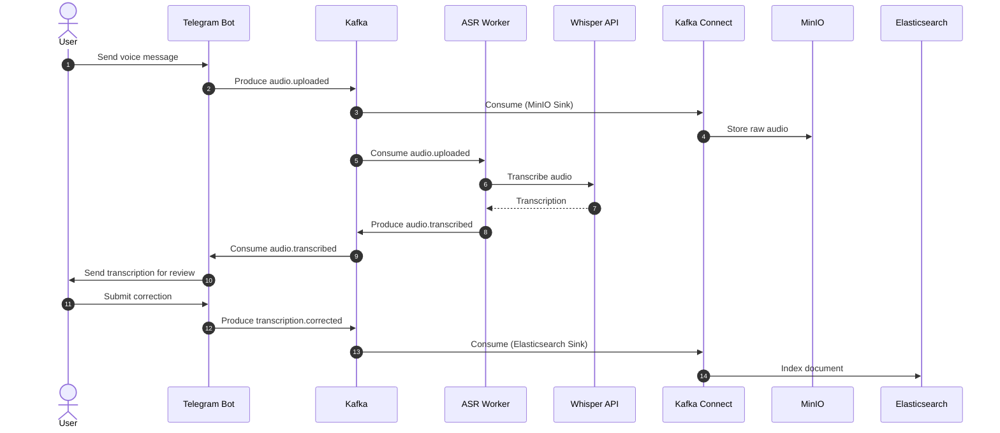

# 🎙️ DataBot — Telegram Voice Transcription Pipeline

An event-driven pipeline that turns Telegram voice messages into searchable text. Audio is transcribed via **Whisper (ASR)**, reviewed and corrected by the user, then archived in **MinIO** and indexed in **Elasticsearch** for search and visualization in **Kibana** — all orchestrated through **Apache Kafka**.

---

## 📐 Architecture



### Sequence overview



---

## 🧱 Tech Stack

| Component | Role | Notes |
|---|---|---|
| **Apache Kafka 3.x (KRaft)** | Event bus | 3-broker cluster, no Zookeeper, RF=3 on application topics |
| **Kafka Connect (distributed)** | Kafka ↔ external systems | `group.id=connect-cluster`, runs across multiple worker nodes |
| **S3 Sink Connector** (`io.confluent.connect.s3.S3SinkConnector`) | Archives raw audio to MinIO | Installed via `confluent-hub` |
| **Elasticsearch Sink Connector** (`io.confluent.connect.elasticsearch.ElasticsearchSinkConnector`) | Indexes corrected transcriptions | v15.x+ recommended for compatibility with ES 8.15 |
| **MinIO** | S3-compatible object storage for raw audio | Bucket: `audio-archive` |
| **Elasticsearch 8.15** | Transcription index & search | Single-node cluster |
| **Kibana** | Visualization | Data View built on `transcription.corrected*` |
| **Whisper API** | ASR engine | External HTTP endpoint |
| **Python** (`kafka-python`, `python-telegram-bot`, `requests`) | Bot + workers | Producer/consumer logic |
| **SQLite** | Object-name resolution | Maps `message_id → object_name`, since the Sink Connector names files `topic/partition/offset.bin` rather than a logical name |
| **Docker / Docker Compose** | Orchestrates MinIO, Elasticsearch, Kibana | |
| **systemd** | Manages Kafka & Kafka Connect services | `Restart=always` |

---

## 🔑 Design Note: `message_id` as the Correlation Key

Early versions used `user_id` for routing, which caused race conditions when a user sent multiple voice messages in quick succession (files and corrections could not be reliably associated).

**Current design:** `message_id` is the Kafka record key across every producer, worker, topic, and Elasticsearch document.

- **Ordering:** all state transitions for a given voice message land on the same partition.
- **Idempotency:** using `message_id` as the Elasticsearch document `_id` (with `key.ignore: false`) makes corrections idempotent upserts instead of duplicate documents.

---

## 📡 Kafka Topics & Schemas

### `audio.uploaded`
```json
{
  "message_id": "msg_88392011",
  "chat_id": 123456789,
  "user_id": 987654321,
  "telegram_file_id": "AwACAgQAAx...",
  "audio_url": "s3://audio-archive/msg_88392011.ogg",
  "duration_seconds": 12,
  "timestamp": "2026-07-26T14:32:00Z"
}
```

### `audio.transcribed`
```json
{
  "message_id": "msg_88392011",
  "chat_id": 123456789,
  "user_id": 987654321,
  "audio_url": "s3://audio-archive/msg_88392011.ogg",
  "model_transcription": "Hello, this is a test audio message.",
  "asr_model_version": "whisper-large-v3",
  "confidence_score": 0.94,
  "processing_time_ms": 420,
  "timestamp": "2026-07-26T14:32:01Z"
}
```

### `transcription.corrected`
```json
{
  "message_id": "msg_88392011",
  "chat_id": 123456789,
  "user_id": 987654321,
  "audio_url": "s3://audio-archive/msg_88392011.ogg",
  "model_transcription": "Hello, this is a test audio message.",
  "user_correction": "Hello, this is a test audio message!",
  "wer": 0.0,
  "cer": 0.027,
  "is_edited": true,
  "timestamp": "2026-07-26T14:32:15Z"
}
```

---

## 📄 Key Files & Module Reference

| File / Component | Category | Operational Purpose & Responsibilities |
|---|---|---|
| `config/settings.py` | Configuration | **Central Environment Config.** Loads environment variables from `.env` (Telegram token, Kafka brokers, MinIO endpoints, Whisper API, Elasticsearch URIs) and exposes unified singleton settings. |
| `services/kafka_service.py` | Core Service | **Kafka Client & Message Builder.** Standardizes Kafka event schemas across `audio.uploaded`, `audio.transcribed`, and `transcription.corrected` topics. |
| `services/minio_service.py` | Core Service | **Stateless S3 Storage Client.** Uploads `.ogg` audio files using deterministic keys (`{message_id}.ogg`) and retrieves raw audio streams without needing stateful tracking. |
| `services/whisper_service.py` | Core Service | **Whisper API Integration.** Takes `.ogg` audio buffers, sends HTTP POST requests to the Whisper ASR endpoint, and returns structured transcription text. |
| `services/elastic_service.py` | Core Service | **Search & Metrics Indexer.** Interfaces with Elasticsearch to index transcription data, user corrections, and error metrics for Kibana dashboards. |
| `services/object_name_store.py` | Core Service | **Object Name Resolver.** SQLite table mapping `message_id → object_name`, since the S3 Sink Connector names files by `topic/partition/offset.bin` rather than a logical name. |
| `bot/handlers.py` | Application Logic | **Telegram Event Handlers.** Captures voice notes, streams audio to MinIO, emits `audio.uploaded` events to Kafka, and handles text corrections from users. |
| `bot/asr_consumer.py` | Application Logic | **Bot Async Consumer.** Continuously listens to `audio.transcribed` Kafka events and replies directly to the Telegram user with the transcribed text. |
| `utils/metrics.py` | Utility | **ASR Error Calculator.** Computes Word Error Rate (WER) and Character Error Rate (CER) using Levenshtein distance when users send corrected transcriptions. |
| `main.py` | Entry Point | **Telegram Bot Application.** Initializes the Telegram bot client, registers event handlers, and launches the background ASR response loop. |
| `asr_worker.py` | Entry Point | **Scalable ASR Worker.** Event-driven worker that consumes `audio.uploaded` tasks, fetches audio from MinIO, invokes Whisper ASR, and publishes `audio.transcribed`. |
| `run.py` | Utility / Script | **Cross-Platform Launcher.** Python script for Linux and Windows that cleans up obsolete files, rebuilds Docker images without cache, starts services, and streams live logs. |
| `minio-sink.json` | Connector Config | **Kafka Connect S3 Sink.** Configuration file that tells Kafka Connect to mirror audio metadata and transcriptions directly into MinIO S3 storage. |
| `elasticsearch-sink.json` | Connector Config | **Kafka Connect ES Sink.** Configuration file that sinks Kafka event streams straight into Elasticsearch indices for analytics. |
| `Dockerfile` | Deployment | **Unified Container Spec.** Builds the Python 3.11 image with `ffmpeg` and dependencies installed; shared by both the Bot and Worker containers. |
| `docker-compose.yml` | Deployment | **Service Orchestrator.** Defines `telegram-bot` and `whisper-worker` containers, environment mappings, and horizontal scaling limits. |
| `requirements.txt` | Dependencies | **Pinned Python Packages.** Lists all required packages (e.g., `python-telegram-bot`, `kafka-python`, `minio`, `elasticsearch`, `requests`, `python-dotenv`). |
| `.env` | Environment | **Secrets & Host IPs.** Contains environment-specific tokens, URLs, passwords, and broker addresses (kept out of Git version control). |

---

## ⚙️ Prerequisites

- Docker (v20.10+) and Docker Compose (v2.0+)
- Python 3.10+
- A running Kafka cluster (KRaft mode) and Kafka Connect with the S3 and Elasticsearch sink plugins installed
- Access to a Whisper ASR endpoint

## 🔐 Environment Variables (`.env`)

> Never commit real credentials. Use a secrets manager or a local `.env` excluded from version control.

```env
# Telegram
TELEGRAM_BOT_TOKEN=

# Kafka
KAFKA_BOOTSTRAP_SERVERS=kafka1:9092,kafka2:9092,kafka3:9092
KAFKA_GROUP_ID=telegram_asr_group

# MinIO / S3
MINIO_ENDPOINT=
MINIO_ACCESS_KEY=
MINIO_SECRET_KEY=
MINIO_BUCKET_NAME=audio-archive
MINIO_SECURE=False

# Whisper ASR
WHISPER_ENDPOINT=

# Elasticsearch
ELASTIC_URL=
ELASTIC_INDEX=transcription.corrected
```

---

## 🚀 Running the Project

**Recommended (cross-platform):**
```bash
python3 run.py
```

**Manual Docker workflow:**
```bash
# Tear down existing containers
docker compose down --remove-orphans

# Build without cache
docker compose build --no-cache

# Start in background
docker compose up -d

# Follow logs
docker compose logs -f
```

## 📈 Horizontal Scaling

The ASR worker is stateless and can be scaled freely:

```bash
docker compose up -d --scale whisper-worker=4
```

> Ensure `audio.uploaded` has at least as many partitions as workers in the consumer group, so all workers can process messages concurrently.

---

## 🧪 Operational Checks

```bash
# Kafka topics & cluster health
kafka-topics.sh --list --bootstrap-server kafka1:9092
kafka-topics.sh --describe --topic audio.uploaded --bootstrap-server kafka1:9092

# Kafka Connect status
curl http://<connect-host>:8083/connectors
curl http://<connect-host>:8083/connectors/audio-minio-sink/status
curl http://<connect-host>:8083/connectors/transcription-es-sink/status

# Elasticsearch
curl http://<es-host>:9200/_cat/indices?v
curl "http://<es-host>:9200/transcription.corrected/_search?pretty"
```

---

## 🩹 Known Issues & Operational Notes

- **Object naming:** the S3/MinIO sink connector names objects by `topic/partition/offset.bin`, not by a logical filename — the `object_name_store.py` SQLite table resolves the real object name per `message_id`.
- **Duplicate documents:** if Elasticsearch documents don't upsert correctly despite `key.ignore: false`, verify the Kafka record key is actually set at emit time and check the connector's `document.id.strategy`.
- **Version compatibility:** Elasticsearch Sink Connector v14.x uses the deprecated `RestHighLevelClient` and is incompatible with Elasticsearch 8.15 — upgrade to v15.1.0+.
- **Single-node Elasticsearch:** set `number_of_replicas: 0` on indices, otherwise the cluster health stays `yellow`.
- **Kafka Connect internal topics** (`connect-offsets`, `connect-configs`, `connect-status`) must be created with `cleanup.policy=compact` and the expected partition counts; incorrect auto-created defaults will cause repeated `Received unknown topic or partition` warnings and prevent the worker from starting.
- **Code/infra drift:** always confirm the deployed code matches the Kafka topic names actually in use (`git status && git pull`) before debugging further — topic renames are a common source of silent failures.

---

## 📄 License

